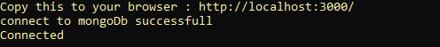

# badword-sensor

## How to make badword censor
- Write whatever you want to censor in `badword/badword.csv`

- Open mongoDb Compass

- Import to mongoDb

## Run Program
- Run server : `node server.js`

- Open browser and type this : `localhost:3000`

- Result

## Requirement
- [npm](https://nodejs.org/en/)
- Package : `npm install`
- [mongoDb](https://www.mongodb.com/)

